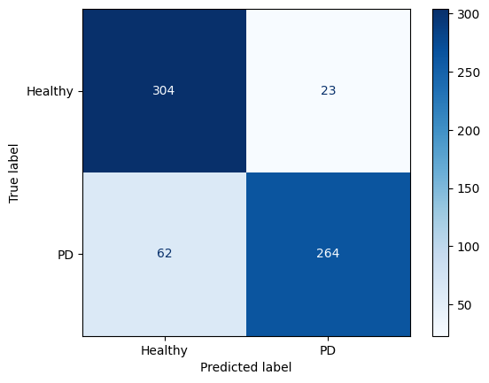

> **Note:** Most notebook cell outputs have been cleared to keep the repository clean and easier to navigate. 
> 
> All code cells are preserved and fully executable. 
> 
> Key outputs, such as confusion matrices, are included in the README file, and training logs are available in the `results/` folder as text files.

# Phase ONE [**DONE**]
- All files created and working.
- Compared between all 5 models, accuracy and losses, when training them for:
    - 5 epochs
    - 10 epochs
- Finetuned the best model , `DenseNet50`, and trained it for extra 50 epochs. (found in 'experiments/finetuning/finetune_test1.iypnb')

## Best results from **PHASE ONE**
- Validation Accuracy: **87.7%**
- 

## Conclusion
- Need to fix false negatives being more than false postives.
- The old loss function only had `BinaryCrossEntropy`, I couldn't work with `FocalLoss` or `TverskyLoss` from `monai.losses` as they were for segmentation, not classifcation.
- I have to measure *recall* for better evaluation of the model.

---

# Phase TWO [**DONE**]
- Updated the loss function to include **focal** and **tversky**, by manually getting their equations in code form.
- Updated the metric function to measure *recall*.
- Updated scheduler from `ReduceLROnPlateau` to `OneCycleLR` for more aggressive LR changes with fewer epochs.
- Increased inital LR from `1e-4` to `3e-4`.

## Best results from **PHASE TWO**
- Validation Accuracy: **89.37%**
- Validation Recall: **0.8407**
- 
## Conclusion
- Changing the *scheduler* made the accuracy increase way faster.
- The new *loss function* needed many hyperparameters tuning, but now it is balanced.
- After only 10 epochs the model gave comparable outputs to the one trained for over 50 epochs. (found in 'experiments/finetuning/finetune_test2.iypnb')
- `DenseNet50` is still superior in accuracy, recall, and model size. 
- `VGG19_bn` is very promising, and has better recall, but the model is so much larger than `DenseNet50`. (may experiment with it more later)

## TO DO (for phase three maybe)
- Keep testing new hyperparameters until we reach the best balance between *accuracy* and *recall*.
- Unfreeze some layers in the middle of the model.
- Compare `DenseNet50` with and without `CLAHE` in `val_dataloader`.
- Compare `DenseNet50` with the trained image size of `(224, 224)` and with `(512, 512)`.
- Just search for ways to **increase overall accuracy**.

> **NOTE:**  In the final model we will **increase** the prediction threshold from being just `50%` to maybe `48%` or `49%` to minimize false negatives even more.

---

# Phase THREE
- Updated the calssifier of the model, taking inspiration from [This paper](https://ieeexplore.ieee.org/document/10307641) (for more details see the `improved_classifier.md` file). This however increased the number of trainable parameters from `1,921` to `508,289`.
- Added gradient clipping to training loop.
- Updated max_lr from `3e-4` to `1e-3`.
- Added precision,and F1-score calculations.

