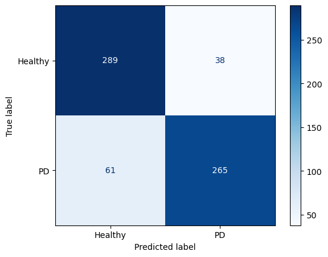

# Phase ONE **DONE**
- All files created and working.
- Compared between all 5 models, accuracy and losses, when training them for:
    - 5 epochs
    - 10 epochs
- Finetuned the best model , `DenseNet50`, and trained it for extra 50 epochs. (found in 'experiments/fintuning/finetune_test1.iypnb')

## Best results from **PHASE ONE**
- Validation Accuracy: **87.7%**
- 

## Conclusion
- Need to fix false negatives being more than false postives.
- The old loss function only had `BinaryCrossEntropy`, I couldn't work with `FocalLoss` or `TverskyLoss` from `monai.losses` as they were for segmentation, not classifcation.
- I have to measure *recall* for better evaluation of the model.

---

# Phase TWO **IN PROGRESS**
- Updated the loss function to include **focal** and **tversky**, by manually getting their equations in code form.
- Updated the metric function to measure *recall*.
- Updated scheduler from `ReduceLROnPlateau` to `OneCycleLR` for more aggressive LR changes with fewer epochs.
- Increased inital LR from `1e-4` to `3e-4`.

## TO DO
- Compare all the models again with the new changes. (only 10 epochs)
- Tune the best model, most likely `DenseNet50`, for 50 extra epochs.
- Keep testing new hyperparameters untill we reach the best balance between *accuracy* and *recall*.

## Conclusion (so far)
- Changing the scheduler made the accuracy increase way faster.
- The new loss function needed many hyperparameters tuning, but now it is balanced.
- after only 10 epochs the model gave comparable outputs to the one trained for over 50 epochs. (found in 'experiments/fintuning/finetune_test2.iypnb')
    - Validation Accuracy: **85.1%**
    - 