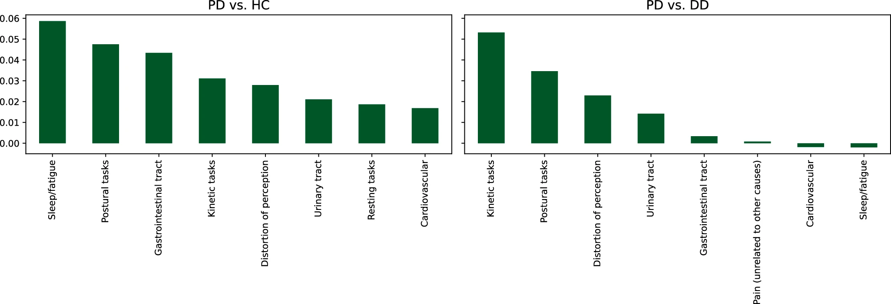

## **You CAN use only SOME movements** - you don't need all of them! 

In fact, using **3-5 carefully selected movements** often works just as well as using all of them, with much less complexity.

---

### **🔍 WHICH MOVEMENTS ARE MOST USEFUL FOR PD DETECTION?**

Based on research and the PADS dataset structure:

**Top 3 Most Discriminative Tasks:**
1. **Postural tasks** (Relaxed1/2, StretchHold)
   - Shows **tremor at rest** and **postural instability**
   - PD patients have resting tremor (4-6 Hz)

2. **Finger tapping** (Entrainment1/2)
   - Shows **bradykinesia** (slowness of movement)
   - PD patients have slower, smaller movements

3. **Reaching tasks** (TouchNose, DrinkGlas)
   - Shows **movement coordination** and **intention tremor**
   - PD patients have jerky, uncoordinated movements

**Less Useful Tasks:**
- CrossArms, HoldWeight - less specific to PD symptoms
- LiftHold, PointFinger - (PADS repo removes these entirely!)

---

## **TASK GROUPINGS BY DISCRIMINATIVITY (From PADS Paper)**

Based on Figure 3 of the PADS study (Varghese et al., 2024, npj Parkinson's Disease):


```.json
"movement_groups": {
    "Postural tasks": ["StretchHold", "HoldWeight", "Entrainment1", "Entrainment2"], 
    "Kinetic tasks": ["DrinkGlas", "CrossArms", "TouchNose"],
    "Resting tasks": ["Relaxed1", "Relaxed2", "RelaxedTask1", "RelaxedTask2"], 
    }
```

### **Group 1: Most Discriminative (PD vs Healthy)**
1. **Sleep/Fatigue questions** (questionnaire)
2. **Postural tasks** (movement)
3. **Kinetic tasks** (movement)

### **Group 2: Most Discriminative (PD vs Other Disorders)**
1. **Kinetic tasks** (movement) - HIGHEST
2. **Postural tasks** (movement)
3. **Cognitive questions** (questionnaire)

---