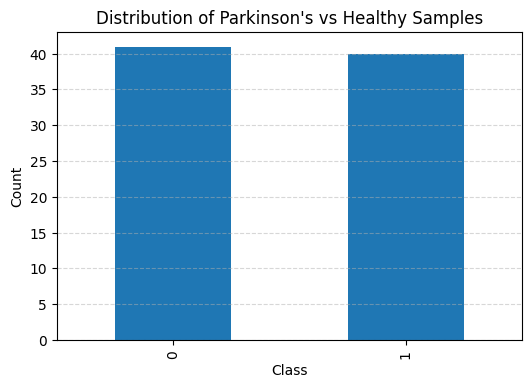
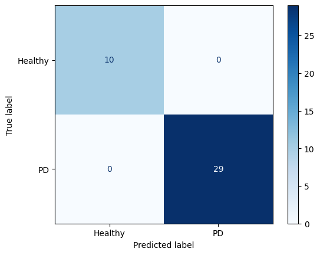
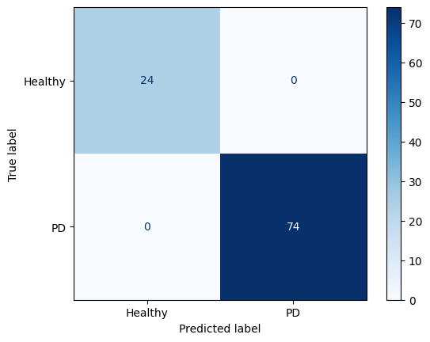

## Dataset used: 



---

## GAN used:
- TVAE (Tabular VAE)

```
(1/2) Evaluating Column Shapes: |██████████| 26/26 [00:00<00:00, 72.99it/s]|
Column Shapes Score: 87.43%

(2/2) Evaluating Column Pair Trends: |██████████| 325/325 [00:05<00:00, 57.29it/s]|
Column Pair Trends Score: 92.2%

Overall Score (Average): 89.81%

Overall Quality Score: 0.8981411166402432
Detailed Properties:
             Property     Score
0       Column Shapes  0.874290
1  Column Pair Trends  0.921992
-----------------------------------
```

---

## Model Architectures:
- `ResNet18`: 11.7M
- `DenseNet121`: 8M
- `EfficientNet-B0`: 5M
- `MobileNet_V2`: 2.5M
- `MobileNet_V3`: 5.5M

---

## Results:
### 1. WITHOUT PRE-TRAINING (real data only)
- Best Model: `DenseNet121`
  - val_acc=0.9688
  - val_recall=1.0000
  - val_precision=0.9615
  - val_f1=0.9800


### 2. PRE-TRAINING (generated data plus real data) (80-20 split)
- Best Model: `EfficientNet-B0`
  - val_loss=0.0001
  - val_acc=1.0000
  - val_recall=1.0000
  - val_precision=1.0000
  - val_f1=1.0000



### 3. PRE-TRAINING (generated data plus real data) (50-50 split)
- Best Model: `EfficientNet-B0`
  - val_loss=0.0032
  - val_acc=1.0000
  - val_recall=1.0000
  - val_precision=1.0000
  - val_f1=1.0000

