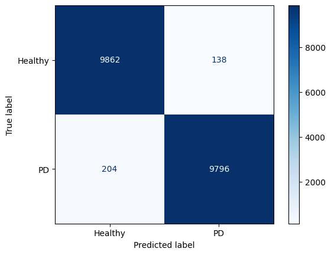

## Dataset used: 
- Metadata and questionaires from PADS dataset.

## GAN used:
- TVAE (Tabular VAE)

```
(1/2) Evaluating Column Shapes: |██████████| 34/34 [00:00<00:00, 126.39it/s]|
Column Shapes Score: 91.69%

(2/2) Evaluating Column Pair Trends: |██████████| 561/561 [00:04<00:00, 133.82it/s]|
Column Pair Trends Score: 87.36%

Overall Score (Average): 89.53%

Overall Quality Score: 0.8952519609726093
Detailed Properties:
             Property     Score
0       Column Shapes  0.916864
1  Column Pair Trends  0.873640
-----------------------------------
```

---

## Model Used:
- `EfficientNet-B0`: 5M
---

## Results:
### 1. PRE-TRAINING (generated data)
- val_loss=0.0960
- val_acc=0.9831
- val_recall=0.9787
- val_precision=0.9878
- val_f1=0.9831



### 2. FINETUNING (generated data plus real data)

- val_loss=0.0618
- val_acc=0.9896
- val_recall=0.9881
- val_precision=1.0000
- val_f1=0.9939
- 
