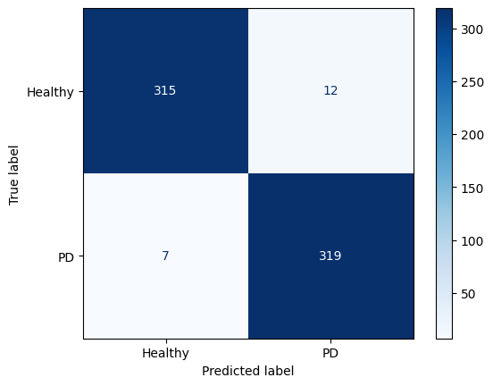

# PD-Detection-Models
Multi-modal Parkinson’s Disease detection pipelines featuring models for spiral drawing, tremor, and audio-based analysis.

## Part 1: Spiral and wave drawings Model [DONE]
### Model used: 
`DenseNet201` with modified classifier.

### Dataset size: 
- **2611**: Training
- **653**: Validation

### Number of trained epochs: 
- **15**: initial model comparisons
- **43**: fine-tuning with early stopping; planned 50.

### Metrics:
- Validation *Accuracy*: **97.02%**
- Validation *Recall*: **0.9787**
- Validation *precision*: **0.9609**
- Validation *F1-Score*: **0.9689**

## Part 2: Tremor Model [IN-PROGRESS]
### Model used: 
Movement-Aware `TremorNetV9`.

### Model Architecture:
  - **Multi-Scale Time-Domain CNN:** Three parallel CNN branches (fast, mid, slow) with different kernel sizes to capture tremor patterns at multiple frequencies. Includes Squeeze-Excitation (SE) for channels and Temporal Attention for important time steps.
  - **Dominant Hand Super-Pathway:** Dedicated, 3× capacity CNN branch for the dominant hand, emphasizing diagnostically relevant signals.
  - **Frequency & Statistical Features:** Computes log-power spectrograms per IMU channel and coarse band energies; extracts statistical moments (mean, variance, skew, kurtosis).
  - **Contrastive & Bilateral Features:** Captures left-right asymmetry and bilateral coordination via attention mechanisms.
  - **Clinical Metadata Integration:** Encodes age, BMI, family history, alcohol effects; integrates with signal features using cross-attention.
  - **Movement Embeddings:** Encodes movement type to provide context to the model.
  - **Fusion & Classifier:** Concatenates all features, including CNN, dominant-hand, frequency/statistics, asymmetry, bilateral, embeddings, and metadata; uses a deep MLP for final tremor severity prediction.

### Dataset size: 
- **355** total patients where:
    - **79** Healthy
    - **276** Parkinson’s Disease (PD)
- It consists of **11** different type of movements (each movement recorded twice for each wrist).
- According to the movement type, some are 10 seconds (**1024** samples), and others are 20 seconds (**2048** samples)
- The signal is structured with **6-channels** (3-axis accelerometer + 3-axis gyroscope.)

> Total: (355) x (11 x 2) x (1024 X 6)

### Number of trained epochs: 
- Best **Validation**: 6
- Best **Training**: 38

### Metrics:
- Best *Validation* **Accuracy**: **0.8575**
- Best *Validation* **F1-Score**: **0.7953**

- Best *Training* **Accuracy**: **0.9456**
- Best *Training* **F1-Score**: **0.9456**

> Confusion matrix at threshold = 0.3

---

## Part 3.1: Audio Model (Tubular) [DONE]
### Model used: 
`DenseNet201`.

### Dataset size: 
#### Generated data (used in pre-training):
- Model used: TVAE (Tabular VAE)
- Generated data accuracy:
    - Column Shapes Score: **83.06%**
    - Column Pair Trends Score: **92.87%**
    - Overall Score (Average): **87.97%**
- Generated: 100k samples
    - **80K**: Training
    - **20K**: Validation

#### Real data (used in finetuning):
- **156**: Training
- **39**: Validation

### Number of trained epochs: 
- **15**: pre-training on *generated* data
- **25**: finetuned on *real* data with early stopping; planned 50.

### Metrics:
- Validation *Accuracy*: **96.88%**
- Validation *Recall*: **1.0000**
- Validation *precision*: **0.9615**
- Validation *F1-Score*: **0.9800**

---
## Part 3.2: Audio Model (Audio) 