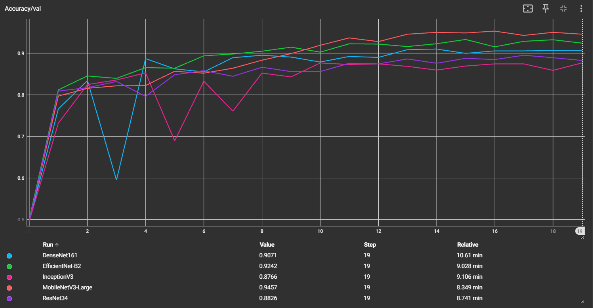
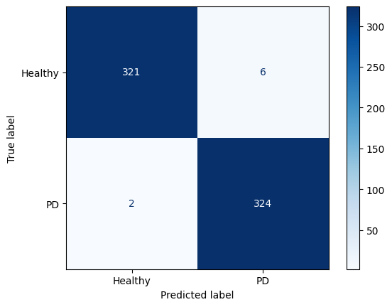
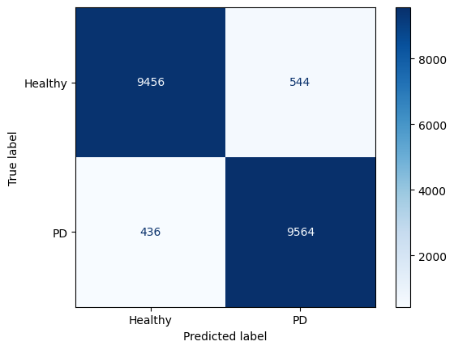
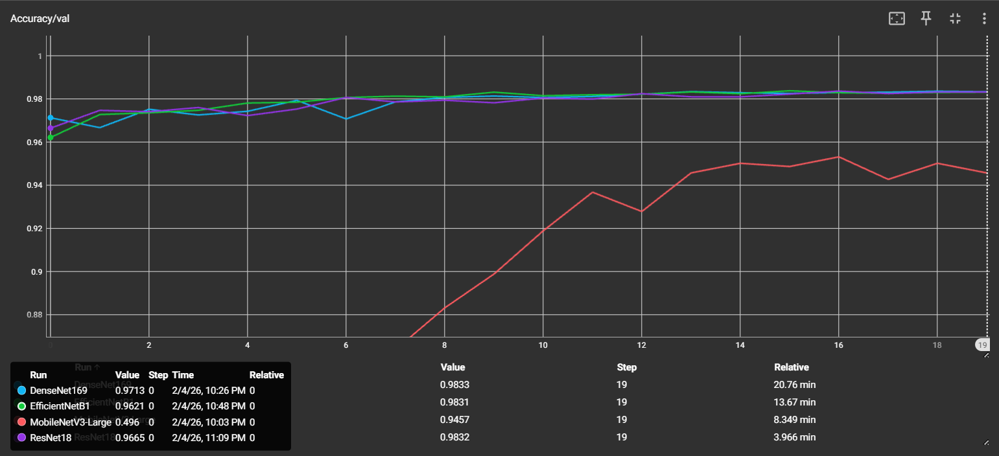
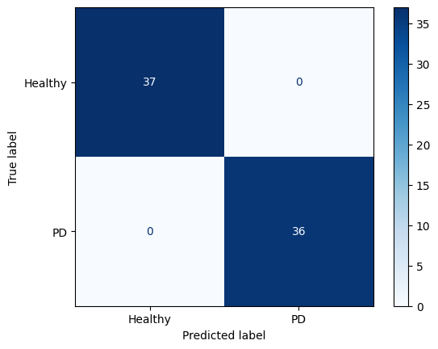
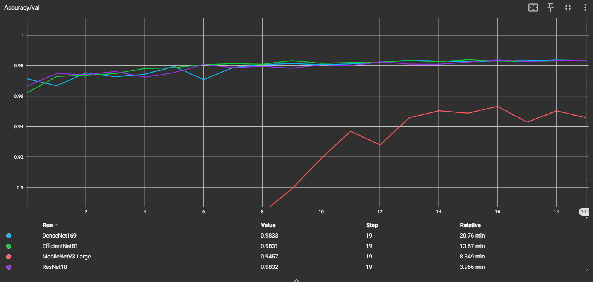

# PD-Detection-Models
Multi-modal Parkinson’s Disease detection pipelines featuring models for spiral drawing, tremor, and audio-based analysis.

## Part 1: Spiral and wave drawings Model
### Models compared:

### Model used: 
`MobileNetV3LargeBinary` with modified classifier.

### Dataset size: 
- **2611**: Training
- **653**: Validation

### Number of trained epochs: 
- **20**: initial model comparisons
- **50**: fine-tuning with early stopping; planned 50.

### Metrics:
- *Accuracy*: **98.81%**
- *Recall*: **99.27%**
- *precision*: **98.30%**
- *F1-Score*: **98.75%**

---

## Part 2: Tremor Model

### Model
- **Input**
  → Tremor features + movement type + handedness

- **Embeddings**
  → Convert categorical inputs to learned vectors

- **Projection**
  → Map all inputs to a shared hidden space
  
- **Feature Attention**
  → Learn which features matter most

- **Residual Blocks**
  → Deep feature refinement with stable training

- **Classifier**
  → Single output logit (Healthy vs. Parkinson’s)

### Generated data (used in pre-training):
- Model used: TVAE (Tabular VAE)
- Generated data accuracy:
    - Column Shapes Score: **92.53%**
    - Column Pair Trends Score: **96.8%**
    - Overall Score (Average): **94.67%**
- Generated: 100k samples
    - **80K**: Training
    - **20K**: Validation

### Metrics:
- Validation *Accuracy*: **91.17%**
- Validation *Recall*: **90.03%**
- Validation *precision*: **92.13%**
- Validation *F1-Score*: **91.16%**

---

## Part 3: Audio Model (Tabular)
### Models compared:

### Model used: 
`DenseNet169`.

#### Generated data (used in pre-training):
- Model used: TVAE (Tabular VAE)
- Generated data accuracy:
    - Column Shapes Score: **87.43%**
    - Column Pair Trends Score: **92.2%**
    - Overall Score (Average): **89.81%**
- Generated: 100k samples
    - **80K**: Training
    - **20K**: Validation

#### Real data (used in finetuning):
> Note: We used a 20:80 train–test split, allocating less data for training and more for testing, since the model had already been trained on a large amount of generated data and demonstrated strong performance.

- **16**: Training
- **65**: Validation

> Note: The model becomes unstable when fine-tuned for too many epochs, so fine-tuning was stopped early after 7–10 epochs.

### Metrics:
- Validation *Accuracy*: **98.75%**
- Validation *Recall*: **100.00%**
- Validation *precision*: **96.67%**
- Validation *F1-Score*: **98.18%**

---

## Part 4: Subject's Metadata Model 
### Models compared:

### Model used: 
`DenseNet169`.

#### Generated data (used in pre-training):
- Model used: TVAE (Tabular VAE)
- Generated data accuracy:
    - Column Shapes Score: **91.69%**
    - Column Pair Trends Score: **87.36%**
    - Overall Score (Average): **89.53%**
- Generated: 100k samples
    - **80K**: Training
    - **20K**: Validation

#### Real data (used in finetuning):
- **284**: Training
- **71**: Validation

### Metrics:
- Validation *Accuracy*: **99.22%**
- Validation *Recall*: **99.06%**
- Validation *precision*: **100.00%**
- Validation *F1-Score*: **99.52%**

