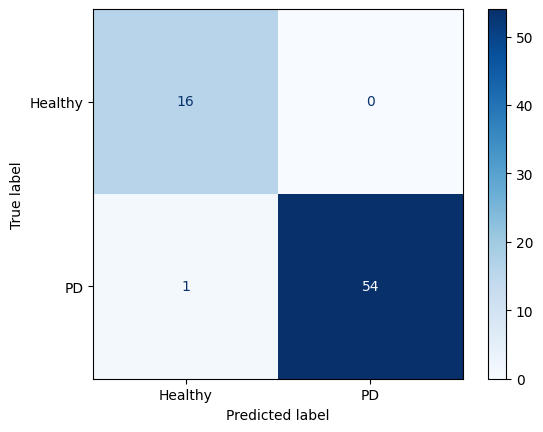

# PD-Detection-Models
Multi-modal Parkinson’s Disease detection pipelines featuring models for spiral drawing, tremor, and audio-based analysis.

## Part 1: Spiral and wave drawings Model [DONE]
### Model used: 
`DenseNet201` with modified classifier.

### Dataset size: 
- **2611**: Training
- **653**: Validation

### Number of trained epochs: 
- **15**: initial model comparisons
- **43**: fine-tuning with early stopping; planned 50.

### Metrics:
- Validation *Accuracy*: **97.02%**
- Validation *Recall*: **0.9787**
- Validation *precision*: **0.9609**
- Validation *F1-Score*: **0.9689**

## Part 2: Tremor Model [IN-PROGRESS]

---

## Part 3.1: Audio Model (Tabular)

---
## Part 3.2: Audio Model (Spectogram) 

---

## Part 4: Subject's Metadata Model
### Model used: 
`EfficientNet-B0`.

#### Generated data (used in pre-training):
- Model used: TVAE (Tabular VAE)
- Generated data accuracy:
    - Column Shapes Score: **91.69%**
    - Column Pair Trends Score: **87.36%**
    - Overall Score (Average): **89.53%**
- Generated: 100k samples
    - **80K**: Training
    - **20K**: Validation

#### Real data (used in finetuning):
- Using 80-20 split:
  - **284**: Training
  - **71**: Validation

### Metrics:
- Validation *Accuracy*: **98.96%**
- Validation *Recall*: **98.81**
- Validation *precision*: **1.0000**
- Validation *F1-Score*: **99.39**

